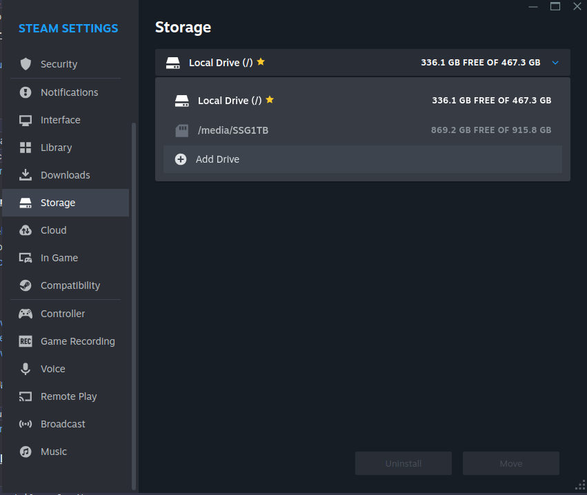
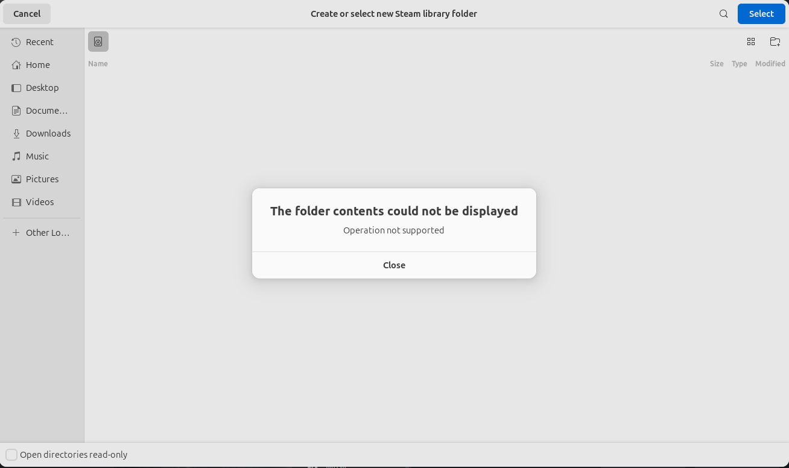
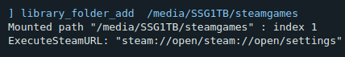

## Problem

I cannot add a mounted drive to steam as a new library storage.

When I click on "Add Drive", instead of popping up a dialog with available drives to choose from, the portal showed up and displayed an error message.





This error appeared in all 3 versions I tried (apt, snap, flatpak)

## Conclusion

### Is it permission issues?

No, I add all potentially needed permissions in snap/flatpak, error stayed the same

Maybe it was something wrong with portal (xdg-desktop-portal-gtk)

## Fix

Here is my final config when I solved the issue:

- Steam is install from apt
- new drive's filesystem is ext4 (not sure if NTFS/FAT would work)

### What to do

#### mount the new drive under `/media` (!!!)

You won't be able to add the drive if it is mounted under `/mnt`

#### Launch steam from terminal using the command

```sh
steam -console
```

This will launch steam as normal, but with an extra "console" button at the app icon on system title bar.

#### Open steam console

Type the following command:

```sh
library_folder_add /path/to/your/drive
```


